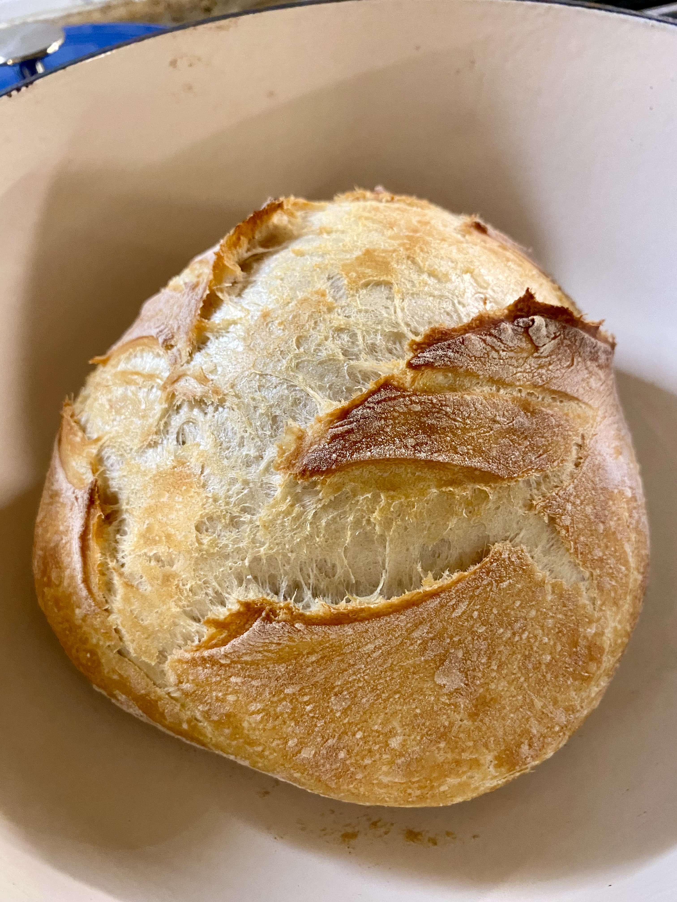

I am a Data Scientist currently at Neudesic, an IBM Company and am primarily working with NLP models for compute/data-constrained use cases. I have written several papers related to these topics, and have collaborated with IBM and Microsoft employees to help improve their own models for content safety and entailment (groundedness). Recently, I have been interested in techniques for explaining a transformer model's output and am working on ways to apply it at scale.

I also have an interest in how ML models can affect, and be affected by, society at large. Particularly, the (often unseen) labor that goes into the development of datasets for large models as well as the ways that these models reflect biases present in our society. I believe that proper analysis of the design of a model and who is affected most are necessary for it to truly benefit society at large.

I have a Bachelor's degree in Data Science from the University of California, Irvine, where I worked at the Office of Research Information and helped perform research in the Department of Neurobiology and Behavior. From those experiences, I learned a lot about the process of research (especially in the health sciences) and it helped spark my interest in performing my own research.

Outside of data science, I love to read (both fiction and nonfiction), cook, bake, and exercise!

 