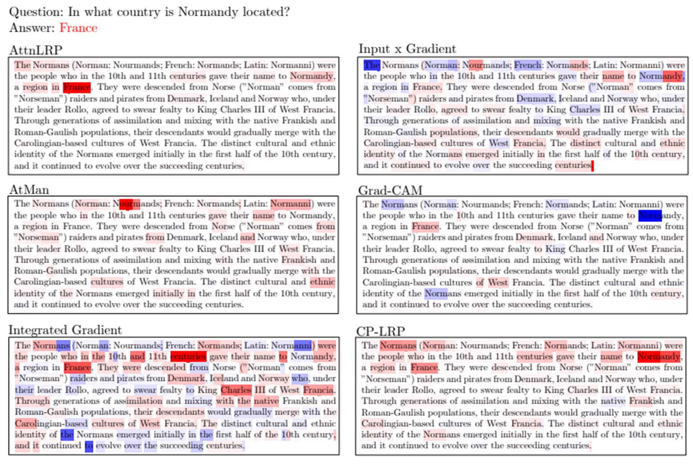
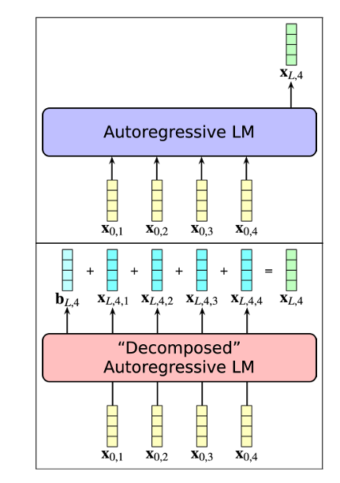
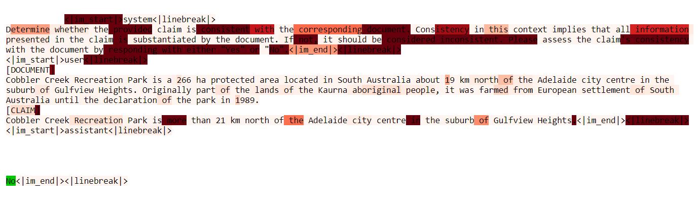
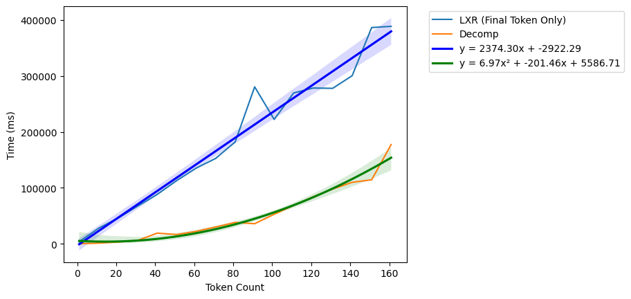
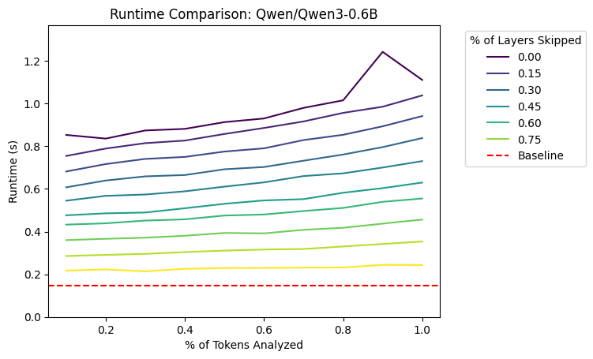

*By decomposing the hidden state of a language model, we are able to interpret *why* a prediction was made.*

## Machine Learning Interpretability
I won't spend much time going over the importance of interpretability in machine learning, but a couple recommended resources for learning about it are Cristoph Molnar's textbook "Interpretable Machine Learning" and Chapter 4 of the University of Helsinki's MOOC on Ethical AI [3,7]. Broadly, interpretable models allow us to provide accountability for affected individuals, be transparent about the reasons behind a model's prediction, and improve the model's performance. 

## Language Model Interpretability
Several methods exist that attempt to create human-interpretable explanations for a model's output, including gradient-based, vector-based, and other methods [6]. However, the one that I'll be focusing on in this blog is called "Token-Wise Decomposition" from Oh & Schuler [8].

*Caption: A set of model explanations for the same question using various techniques [5].*

## Background
Autoregressive language models all perform a specific set of operations on a number of input tokens in order to make a prediction. The result of these operations is a kind of embedding of the input text, called a hidden state. These operations are repeated over a set number of layers to retrieve the final hidden state of the model.

1. Text Embedding: The model creates an initial hidden state by embedding each token individually.
2. Normalization: Each token's hidden state vector is normalized according to a specific model. For example, LLaMA uses Root Mean Squared normalization.
3. Self-Attention: An 'attention matrix' is created from the hidden state of each token, which adjusts each token depending on the others present in the sequence.$^*$
4. MLP: A two-layer neural network is applied to each token's hidden state, typically including 'upscaling', 'downscaling' and nonlinear activation function.

Once these steps are performed for each layer, the final hidden state is then passed to a module specific to a given task. These modules, or 'heads', can be used for virtually any machine learning task, such as token or sequence classification, information retrieval, or token generation.

*: Most models use multi-head attention, where multiple attention matrices are calculated simultaneously and concatenated to create the final attention output. For simplicity's sake, I describe it as only a single matrix here.

## Decomposition Steps

The idea behind decomposition is that each token's hidden state can be broken down, or 'decomposed', into a 2-dimensional diagonal matrix containing that same hidden state. Then, by performing each of the steps defined above, we can retrieve the exact value of each token's contributions to every other token's hidden state. As we progress through the model, we can retrieve the original hidden state for each target token by simply summing over the second (source) dimension. 

For example, if we have a sequence of 10 tokens with a hidden state size of 796, our usual input would be a tensor of shape (10, 796). When we decompose the same hidden state, we would instead have a tensor of shape (10, 10, 796) with each of the 10 values mapped to the 10 x 10 diagonal with 0 everywhere else. Additionally, we create a 'bias' tensor of 0s with shape (10, 796) that tracks the hidden state transformations that cannot be attributed to an individual token.

*Caption: Schematic showing how traditional models calculate a single hidden state vector for each token while a decomposed model creates a pairwise set of hidden states that sums to the undecomposed representation [8].*

Once we create the initial decomposed hidden state, we can move through steps 3 and 4 of the model normally by taking advantage of an interesting property of linear functions. When a linear function like matrix multiplication is applied to both a decomposed hidden state matrix A and the undecomposed version B, the resulting matrix AC remains a decomposed version of AB. Since normalization and self-attention both apply linear functions to each matrix, we can run through each of those steps without modification.

Step 4, however, poses a problem. This is because the activation function of the MLP layer is usually *nonlinear*, meaning the decomposition is broken when passing through it normally. Oh and Schuler solve this by taking a local linear approximation of this activation function at each location, which preserves this relationship if the activation function is differentiable almost everywhere [8].

Since each of our steps now can be applied to the decomposed version, we're able to run through the entire model to retrieve the decomposed hidden states at each layer. From there, we can apply any linear head to these hidden states to create a model output that preserves each token's relationship with each other.

## Text Generation Outputs

To explain the generation of a single token, Oh and Schuler define a specific importance measure, called ∆LP. Since the output of a language model is a probability distribution over all possible tokens to generate, it follows that a token is important if removing that token's contribution has a significant effect on the probability of generating the next token. This is defined formally using the following equation:

$∆LP(w_{i+1} | w_{1..i,wk∈\{1,...,i\}}) = log_{2} P(w_{i+1} | w_{1..i}) − log_{2} P(w_{i+1} | w_{1..i\{k\}})$,

where $w_i$ is the token at index i.

## Classification Outputs

Explaining the output from a classification head is very simple, since it's usually just a linear function of the pooled hidden states of the model. Pooling involves combining the hidden states for each token into a single state that represents the sequence as a whole. Because these functions are also linear, we can apply the classification weights to the decomposed and unpooled hidden states to retrieve a logit value for each source and target token. Then, we can define each source token's contribution to the final prediction as the sum of all 'target' tokens plus the bias term multiplied by the model's pooling weight. For example, if our pooling method takes a simple mean across all tokens, the contribution of source token j is defined as:

$Contribution_j =\sum^{E}_{e=1}\frac{\beta_et_{e,l}}{L-(l-1)}$,

with $E$ being the hidden state dimension of the model, $\beta_e$ being the classifier's weight at dimension $e$, $L$ being the sequence length, and $t_{e,l}$ being the target hidden state of token $l$ at dimension $e$.

## Example: Groundedness Detection (NLI)

To show how decomposition works, I used an example from the 'AggreFact' dataset, containing a set of documents and claims with the goal of predicting whether a claim is supported by the given document [9]. I chose this task specifically since it is much more difficult than other tasks for generative models like content safety classification or jailbreak detection. Using Qwen 3 0.6B with the same prompt as MiniCheck 7B, I retrieved the token importance for generating the token 'No'.

*Caption: Image showing a sample prediction, with token importance being represented by the highlighted color.*

From this visualization, we can see that the instructions in the system prompt had the most effect on the model's response. In addition, the token for 'more' in the phrase 'more than 21 km' as well as '19' in '19 km north' were significant. Because of this, we conclude that the model is using the correct tokens in the input to generate it's response.

However, this also highlights a flaw in using generative models for classification tasks. Despite the model using the correct tokens for its response, we can see that the majority of significant tokens are from the instructions in the prompt, as well as the special tokens related to the 'chat' template the model follows. If we can train a classification model to directly identify ungrounded claims rather than relying on generated tokens, we could likely improve its performance as well as interpretability.

## Optimizing Decomposition Performance

Since we're decomposing a set of N tokens into N^2 pairs of tokens, the performance of the transformer model suffers from quadratic time complexity with respect to the number of tokens. When comparing it to a another technique (LXR), we see that decomposition performs better on a smaller number of tokens, but eventually performing worse at around 360 tokens of input since LXR computes explanations in linear time. With this basic implementation, decomposition doesn't scale well enough to be used in any practical application.

*Caption: Runtime comparison of LXR and decomposition. LXR shows a linear trend based on the number of tokens while decomposition shows a quadratic trend.*

A large reason for this difference is that decomposition computes the token attribution for all pairs of tokens, while LXR works only on a single token at a time. If we were able to reduce the number of tokens being decomposed, decomposition could become more viable. In addition to this, we can decide to skip a certain number of layers inside the model to speed up computation. This has the effect of increasing the magnitude of the bias term when compared to the decomposed version, meaning we are able to attribute less of the overall hidden state to each individual token. However, we find that the relative attribution between tokens for each hidden state remains the same when compared to the full model. Because of this, the token decompositionwhen skipping layers remains relevant to the overall interpretability of the model.

*Caption: Plot showing the runtime of a decomposed model when compared to the baseline model when skipping a certain proportion of layers and analyzing a certain proportion of tokens.*

After modifying the decomposition code to allow for any number of tokens to be analyzed and to skip any number of layers, we compare the overall performance to our baseline for Qwen 3 0.6B. From the above plot, we see that performance similar to our baseline can be achieved by aggressively reducing the number of tokens analyzed and by skipping most layers in the model.

## Conclusion

Compared to other explainability methods for language models, decomposition is significantly more flexible and allows us to see exact contributions to each hidden state. Because of this, I think that it's a super promising method for understanding the outputs of any transformer-based language model.

This method could also work for vision-based transformers or multimodal models, but the two-dimensional nature of images exacerbates the memory and computation problems described earlier. Since we can't reduce the decomposed pixels in an image in the same way as with text, other workarounds must be developed instead.

## References

[1]: Biran, Or, and Courtenay V. Cotton. 2017. “Explanation and Justification in Machine Learning: A Survey.” In Proceedings of the IJCAI-17 Workshop on Explainable Artificial Intelligence (XAI). https://www.cs.columbia.edu/~orb/papers/xai_survey_paper_2017.pdf

[2]: Ribeiro, M. T., Singh, S., & Guestrin, C. (2016, August). "Why should i trust you?" Explaining the predictions of any classifier. In Proceedings of the 22nd ACM SIGKDD international conference on knowledge discovery and data mining (pp. 1135-1144).

[3]: Molnar, C. (2025). Interpretable Machine Learning: A Guide for Making Black Box Models Explainable (3rd ed.). christophm.github.io/interpretable-ml-book/

[4]: Lundberg, S. M., & Lee, S. I. (2017). A unified approach to interpreting model predictions. Advances in neural information processing systems, 30.

[5]: Achtibat, R., Hatefi, S. M. V., Dreyer, M., Jain, A., Wiegand, T., Lapuschkin, S., & Samek, W. (2024). Attnlrp: attention-aware layer-wise relevance propagation for transformers. arXiv preprint arXiv:2402.05602.

[6]: Luo, H., & Specia, L. (2024). From understanding to utilization: A survey on explainability for large language models. arXiv preprint arXiv:2401.12874.

[7]: Rusanen, M., Nurminen, K. Ethics of AI [MOOC]. mooc.fi. https://ethics-of-ai.mooc.fi/

[8]: Oh, B. D., & Schuler, W. (2023). Token-wise decomposition of autoregressive language model hidden states for analyzing model predictions. arXiv preprint arXiv:2305.10614.

[9]: Tang, L., Goyal, T., Fabbri, A. R., Laban, P., Xu, J., Yavuz, S., ... & Durrett, G. (2022). Understanding factual errors in summarization: Errors, summarizers, datasets, error detectors. arXiv preprint arXiv:2205.12854.